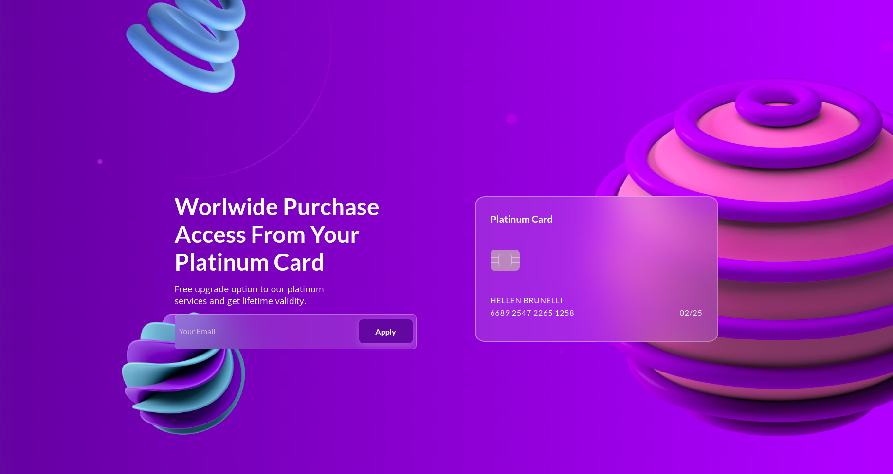

#  Glassmorphism Tutorial

<br/>

Projeto desenvolvido a partir do vídeo tutorial da Gabriela Pinheiro onde abora o tema Glass Morphism (link nas refeências).
</br>
</br>

<b>Desafio proposto: Responsividade</b>
</br>
</br>

Você pode visualizar a página __[aqui](https://glasseffect.netlify.app/)__.  

<br/>

### __**Diferenciais:**__
* **SASS e variáveis**: Utilizando o pré-processador [SASS](https://sass-lang.com/), conseguimos manter a organização.   
As variáveis facilitam na manutenção do site, mantendo a consistência e padrão.

 
## Instalação

1- Baixe o repositório

2- No terminal rode o comando:

```bash
npm i 
```

3- Para compilar o CSS:
```bash
yarn scss
``` 
ou
```bash
npm run scss
```  
<br/>  
<br/>

# Layout

| Mobile | Desktop |
|:---------|---------|
|  |   |

<br/>
<br/>

Referências:
- [Vídeo Tutorial - Gabriela Pinheiro](https://www.youtube.com/watch?v=ufX9oxoKMsQ&list=WL&index=1);
- [Template - Dribbble RH Agency](https://dribbble.com/rhagency);
- [Colors Name](https://chir.ag/projects/name-that-color/)